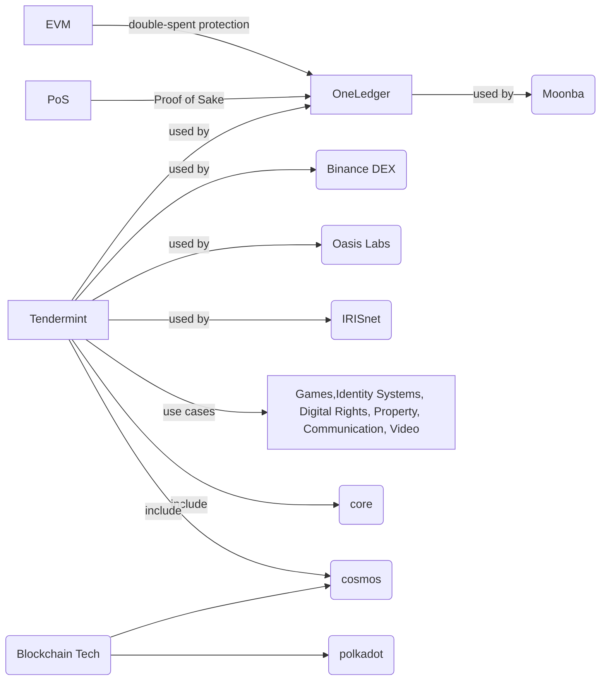

# diagram




# Moonba 

https://www.moonba.co/

- Moonba is built on OneLedger ecosystem

    - https://www.moonba.co/MoonbaSwap-Whitepaper.pdf

# PoW vs PoS

- Ethererum ETH1.0 uses PoW and ETH2.0 uses PoS which is faster and
  more eco-friendly

# MetaMask 

A crypto wallet & gateway to blockchain apps

# Airdrop

- What Is a Cryptocurrency Airdrop?
```

An airdrop, in the cryptocurrency business, is a marketing stunt that involves
sending coins or tokens to wallet addresses in order to promote awareness of a
new virtual currency. Small amounts of the new virtual currency are sent to the
wallets of active members of the blockchain community for free or in return for
a small service, such as retweeting a post sent by the company issuing the
currency.

```

For example in https://www.moonba.co/MoonbaSwap-Whitepaper.pdf page, it says it
uses 2% of $MBA on AirDrop.

# OneLedger

```

OneLedger is a Delegated Proof of Stake (DPoS) blockchain Layer-1 solution
based on Tendermint with Ethereum Virtual Machine (EVM) but with a different
mechanics for re-play, double-spent protection and other security optimisation.
So on the OneLedger side it is called OLVM. Also OneLedger could scale to
Layer-2 solution to give a more TPS and use in custom needs.

```

# Tendermint


```

Write your application in any language. Use Tendermint Core to replicate it on
machines across the world.

```
## What is it

https://docs.tendermint.com/master/introduction/what-is-tendermint.html

# Polkadot

Polkadot is the first fully-sharded blockchain.

# Ethereum vs Cosmos

https://www.hitechies.com/cosmos-vs-ethereum-comparison/

```

The Cosmos blockchain is not a competitor or drop-in replacement for the
Ethereum blockchain in terms of its functionality. Nevertheless, Cosmos
provides complimentary blockchain development frameworks designed so developers
on the network can launch their blockchains.  Presently, the Ethereum
blockchain does not offer this infrastructure to users of its platform.

```


```

We must, however, state that some blockchains created on the Cosmos blockchain
stand as competitors to the Ethereum blockchain. A prime example is the Binance
Smart Chain which delivers faster transactions to users on their platform.
Additionally, the fees attached to transactions on the Binance Smart Chain are
cheaper when compared to transactions on the Ethereum network.

```
# Uniswap

```

What is Uniswap Protocol?

The Uniswap Protocol is an open-source protocol for providing liquidity and
trading ERC20 tokens on Ethereum. 

```
