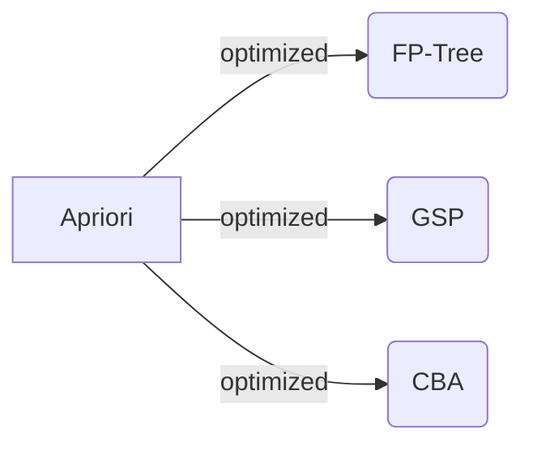

# Apriori Algirithm

Using data to find the colleration of sales items:

https://towardsdatascience.com/data-mining-market-basket-analysis-with-apriori-algorithm-970ff256a92c

# Seaborn: statistical data visualization

https://seaborn.pydata.org/

Using seaborn to virtualize the data:

https://towardsdatascience.com/from-scatter-plot-to-story-the-seaborn-edition-fb15f3c4cd72
